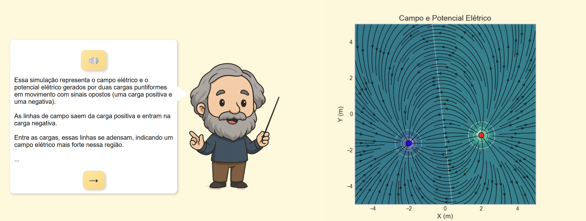

<h1 align="center">💡 Simulador de Campo Elétrico</h1>

<p align="justify">
Este projeto é uma aplicação web interativa desenvolvida com Python (Flask) e JavaScript. Ele permite visualizar e compreender de forma animada os conceitos de campo elétrico, linhas equipotenciais e potencial elétrico gerados por duas cargas puntiformes. A aplicação conta com a presença do Maxwell, um assistente virtual que narra o conteúdo apresentado para tornar a experiência mais inclusiva e didática.
</p>

---

### 📑 Sumário

1. [🧠 Funcionalidades](#funcionalidades)
2. [💻 Como Utilizar a Aplicação](#como-utilizar-a-aplicação)
3. [⚙️ Como Rodar a Aplicação](#como-rodar-a-aplicação)
4. [📁 Estrutura do Projeto](#estrutura-do-projeto)
5. [📦 Requisitos Python](#requisitos-python)
6. [👩‍💻 Autor](#autor)

---

1. ### Funcionalidades

- Geração automática de animações que mostram as linhas de campo e equipotenciais.  
- Leitura em voz do conteúdo exibido (com opção de ativar/desativar som).  
- Textos explicativos dinâmicos com navegação.

---

2. ### Como Utilizar a Aplicação

1. Insira os valores das cargas nos campos disponíveis e clique em **Simular**  


📸 Demonstração  


O mascote **Maxwell** fala com o usuário e exibe explicações baseadas nas cargas inseridas.

---

3. ### Como Rodar a Aplicação

Abra o terminal na pasta `src`.

1. Instale as dependências necessárias:

Escreva:
```
pip install -r requirements.txt
```

2.  Execute o servidor:

```
python app.py
```

3. Acesse a aplicação no navegador

Abra o navegador e acesse:

```
http://127.0.0.1:5000
```

 4. ### Estrutura do projeto

```

├── app.py                  # Servidor Flask
├── templates/
│   └── index.html          # Página principal
├── static/
│   ├── js/                 # Arquivos JS com lógica do Maxwell
│   ├── assets/             # Imagens do mascote Maxwell
│   └── simulacao.gif       # GIF gerado pela simulação
└── README.md               # Este arquivo
```

5. ### Requisitos Python

    Python 3.8+

    Flask

    NumPy

    Matplotlib


6. ### Autor

<p>Pâmela Aliny Cleto Pavan</p>

pamelaaliny@gmail.com